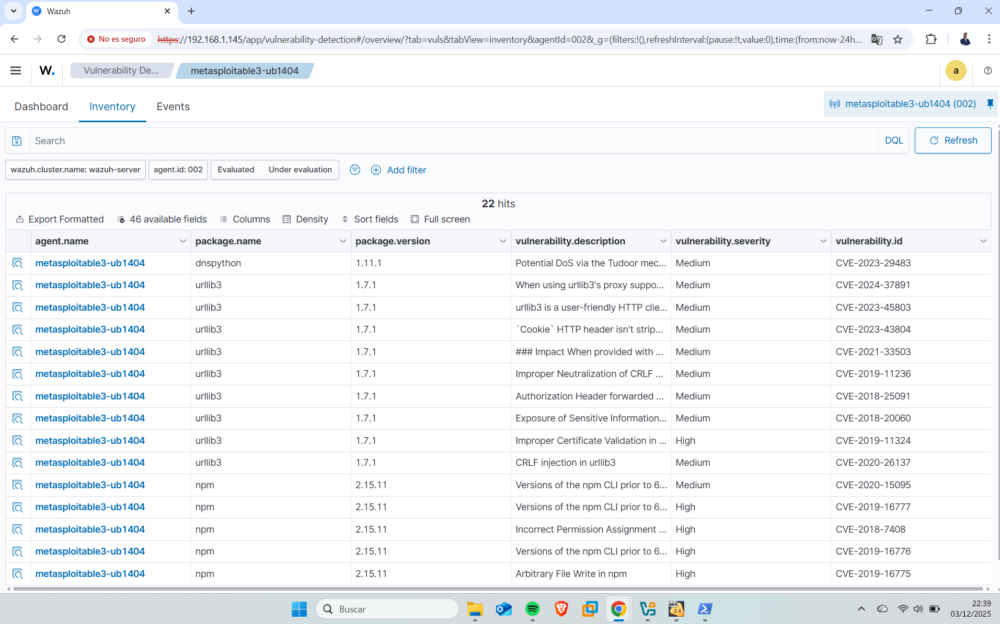
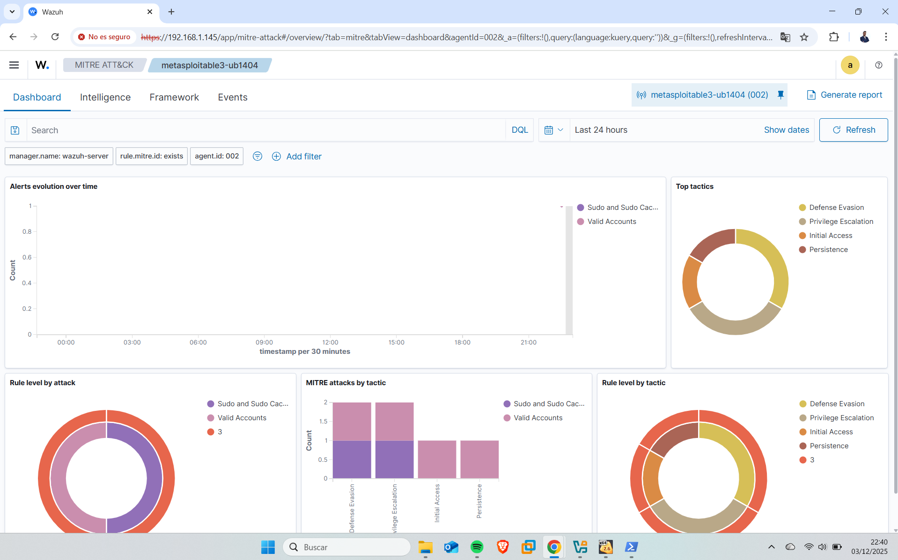
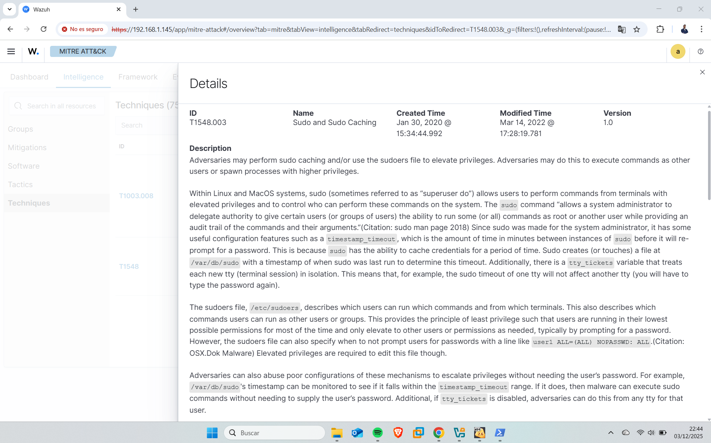
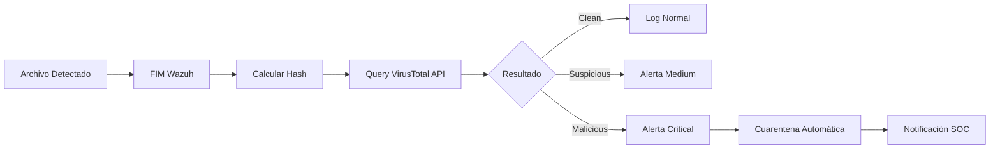

#  Wazuh SIEM - Proyecto de Monitorización y Detección de Amenazas

### Implementación de Wazuh

Para este proyecto diseñé un entorno completo de monitorización y respuesta a incidentes utilizando Wazuh como plataforma central de seguridad. La arquitectura se compone de una máquina dedicada que ejecuta el servicio de Wazuh, accesible a través de un panel SIEM al que me conecto desde un equipo Windows funcionando como estación de analista.

Como endpoint monitorizado incorporé una máquina Metasploitable3, permitiendo observar en tiempo real la recolección de logs, análisis de integridad, detección de vulnerabilidades y correlación de eventos. Finalmente, utilicé una máquina Kali Linux para realizar distintos ataques controlados contra Metasploitable3, con el fin de validar la capacidad del SIEM para generar alertas, detectar comportamientos anómalos y registrar la actividad maliciosa.


###  Preparación del entorno

Descargaremos de la pagina web de Ubuntu su ISO oficial de Ubuntu Server, el cuál, usaremos para que corra nuestro servicio de Wazuh. Una vez instalado nuestro Ubuntu server ejecutaremos los siguientes comandos para preparar e instalar el servicio de Wazuh.

Debemos realizar una actualizacion del sistema operativo, y la instalacion de algunas herramientas necesarios que vamos a necesitar.

```
sudo apt update
sudo apt install vim curl apt-transport-https unzip wget libcap2-bin software-properties-common lsb-release gnupg2
```

Una vez hecho esto ejecutaremos el siguiente script de su pagina oficial

```
curl -sO https://packages.wazuh.com/4.5/wazuh-install.sh && sudo bash ./wazuh-install.sh -a
```

Una vez realizado esto, solo necesitaremos irnos a un navegador e introducir la IP de nuestra maquina que actuara de servidor para poder acceder a Wazuh. Es importante recordar que ambos equipos deben tener conexión entre ellos y deben poder verse. Esto lo podemos comprobar con ping entre ambas maquinas.

### 1 Interfaz de Acceso al SIEM


Plataforma Wazuh SIEM - Sistema de gestión de eventos de seguridad open source diseñado para monitorización 24/7, detección de amenazas y respuesta a incidentes en entornos empresariales.
La conexión se realiza mediante la dirección interna del servidor (192.168.1.144), que es la dirección IP de la maquina virtual donde corre el servicio de Wazuh.


### 2 Dashboard Principal de Seguridad


**Vista general del estado de seguridad:**
- **Agentes**: 1 agente desconectado (requiere investigación)
- **Alertas 24h**: 0 críticas, 0 high, 5 medium, 7 low
- **Vulnerabilidades**: 1 crítica, 7 high, 14 medium detectadas

**Módulos activos:**
- Configuration Assessment (CIS Benchmarks)
- Malware Detection
- Threat Hunting
- File Integrity Monitoring
- MITRE ATT&CK Mapping
- Vulnerability Detection

---

### 3 Menú de Navegación - Módulos del SIEM


**Estructura modular de Wazuh:**
- **Endpoint Security**: Gestión de seguridad de endpoints
- **Threat Intelligence**: Hunting, MITRE ATT&CK, Vulnerabilidades
- **Security Operations**: PCI DSS, GDPR, Docker, AWS
- **Cloud Security**: Integración con proveedores cloud
- **Agents Management**: Despliegue y gestión de agentes
- **Server/Indexer/Dashboard Management**: Administración del cluster

---

### 4 Despliegue de Agentes - Opciones Multiplataforma


**Wizard de despliegue con soporte para:**
- **Linux**: RPM (amd64/aarch64), DEB (amd64/aarch64)
- **Windows**: MSI 32/64 bits
- **macOS**: Intel y Apple Silicon

**Configuración:**
- Dirección del servidor: `192.168.1.10`
- Nombre personalizado del agente: `Endpoint1`
- Comunicación cifrada entre agente y manager

---

### 5 Creación de Nuevo Agente para Windows


**Proceso de registro de agente Windows:**
- Selección de arquitectura: MSI 32/64 bits
- Configuración de servidor manager
- Opciones de naming personalizado
- Documentación técnica integrada para despliegue

---

### 6 Creación de Nuevo Agente para Linux


**Parámetros de configuración:**
La imagen muestra el asistente de Wazuh Manager para el despliegue de nuevos agentes en endpoints. Desde esta interfaz se selecciona el paquete adecuado para la instalación, en este caso Linux DEB amd64, con el objetivo de añadir un nuevo equipo al entorno monitorizado.

En la sección Server address se especifica la dirección IP del servidor Wazuh (192.168.1.10), que permitirá establecer la comunicación entre el agente y el manager. Además, se configuran los Optional settings, donde se asigna un nombre identificativo para el nuevo agente (por ejemplo, Endpoint1) antes de generar las instrucciones o el paquete de instalación.


---

### 7 Comandos de Instalación Automatizada


Esta fase del proceso se ejecuta en la máquina destinada a actuar como endpoint dentro del entorno de monitorización. En ella se instala y configura el agente de Wazuh, componente fundamental para la recolección y envío de datos de seguridad al servidor central.

La instalación incluye la configuración del agente con la dirección IP del servidor Wazuh, garantizando una comunicación segura y persistente para la transmisión de logs, eventos de integridad, alertas de seguridad y métricas del sistema. Además, se asigna un identificador único al endpoint para facilitar su seguimiento y gestión en el panel SIEM.

Este despliegue permite integrar el endpoint al ecosistema de seguridad, habilitando la detección temprana de incidentes y el análisis forense dentro del SOC.


**Script de instalación en Linux (Ubuntu/Debian):**
```bash
wget https://packages.wazuh.com/4.x/apt/pool/main/w/wazuh-agent/wazuh-agent_4.11.1-1_amd64.deb && \
sudo WAZUH_MANAGER='192.168.1.10' WAZUH_AGENT_NAME='Endpoint1' \
dpkg -i ./wazuh-agent_4.11.1-1_amd64.deb
```


---

### 8 Instalación del Agente en Endpoint


**Proceso de instalación ejecutado:**
1. Descarga del paquete desde repositorio oficial (11.07 MB)
2. Resolución de dependencias
3. Desempaquetado e instalación del agente Wazuh 4.11.1
4. Configuración de triggers para actualización automática
5. Notificación de reprofiling en próximo reinicio

**Resultado**: Agente instalado correctamente, pendiente de inicio del servicio.

---

### 9 Verificación de Agente Añadido


**Estado post-instalación:**
- **Agentes por estado**: 1 activo, 0 desconectados, 0 pendientes, 1 nunca conectado
- **Top 5 OS**: Ubuntu (1 agente)
- **Top 5 Groups**: default (1 agente)
- **Agente registrado**: ID 002, nombre `metasploitable3-ub1404`

**Próximo paso**: Iniciar el servicio wazuh-agent para establecer comunicación con el manager.

---

### 10 Monitoreo de Endpoints Activos


**Vista de gestión de agentes:**
- **Estado**: 1 agente activo 
- **Endpoint**: `metasploitable3-ub1404` (ID: 002)
- **IP**: 192.168.1.10
- **Sistema Operativo**: Ubuntu 14.04, Trusty Tahr
- **Cluster**: node01
- **Versión**: Wazuh v4.11.1
- **Fecha de registro**: 10 Oct 2025, 11:45:53

**Acciones disponibles:**
- Deploy new agent
- Refresh status
- Export formatted data
- Configuración WQL (Wazuh Query Language)

---

### 11 Simulación de Ataque al Endpoint


**Escaneo de red detectado con Nmap:**

**Técnica utilizada**: Reconocimiento de red (MITRE ATT&CK: T1046 - Network Service Scanning)

**Servicios descubiertos:**
- **Puerto 21 (FTP)**: vsftpd abierto
- **Puerto 22 (SSH)**: OpenSSH con múltiples algoritmos de cifrado
- **Puerto 80 (HTTP)**: Apache con directorio `/phpmyadmin/` expuesto
  - Archivo crítico detectado: `payroll_app.php` (1.7K)
- **Puerto 445 (SMB)**: Microsoft-DS activo
- **Puerto 3306 (MySQL)**: Base de datos expuesta
- **Puerto 8080 (HTTP-Proxy)**: Servicio secundario

**Hallazgos de seguridad:**
- Certificado SSL caducado (válido hasta 2020-10-27)
- Sistema operativo identificado: Windows 6.1 (Samba 4.3.11-Ubuntu)
- Configuración SMB insegura: `message_signing: disabled` (peligroso pero por defecto)

**Vectores de ataque potenciales identificados:**
- Fuerza bruta en SSH/FTP
- Explotación de aplicaciones web (PHPMyAdmin, payroll_app.php)
- Ataques a base de datos MySQL
- SMB relay attacks

---

### 12. Gestión de Vulnerabilidades


**Análisis de superficie de ataque del endpoint `metasploitable3-ub1404`**

El análisis automatizado identificó **22 CVEs** distribuidas en componentes críticos del sistema, con un nivel de riesgo que requiere remediación inmediata.

#### Clasificación por Impacto:
| Severidad | Cantidad | Riesgo Principal |
|-----------|----------|------------------|
| 🔴 Critical | 1 | Buffer Overflow en criptografía |
| 🟠 High | 7 | Ejecución remota de código, credential leakage |
| 🟡 Medium | 14 | Inyección, traversal, DoS |

#### Vectores de Ataque Identificados:
- **Ejecución Arbitraria de Comandos** (CVE-2019-16777) - npm
- **Validación Incorrecta de Certificados** (CVE-2019-11324) - urllib3
- **Exposición de Credenciales** (CVE-2018-18074) - requests
- **Generación de Claves Débiles** (CVE-2018-6594) - pycrypto

#### Plan de Remediación:
```bash
# Prioridad Alta (SLA: 48h)
apt-get update && apt-get upgrade urllib3 npm requests

# Prioridad Media (SLA: 7 días)
pip install --upgrade cryptography
apt-get remove python-crypto
```

#### Métricas de Exposición:
- **CVSS Score Promedio:** 7.2/10
- **Tiempo de exposición:** 2,847 días (desde 2017)
- **Superficie de ataque:** 5 paquetes comprometidos
- **Impacto potencial:** Compromiso total del sistema

---

### 13 Detección de Técnica de Evasión (MITRE ATT&CK)


**Alerta de seguridad: Defense Evasion detectada**

**Técnica MITRE ATT&CK:**
- **ID**: T1562.001 - Disable or Modify Tools
- **Táctica**: Defense Evasion
- **Versión**: 1.4

**Detalles del incidente:**
- **Timestamp**: 2 Dic 2025, 20:52:46.920
- **Técnica**: Defense Evasion
- **Nivel de severidad**: 3 (Medium)
- **Rule ID**: 504
- **Descripción**: Wazuh agent disconnected

**Eventos recientes (últimas 24h): 194 hits**

**Eventos correlacionados:**
1. **20:52** - Agente Wazuh desconectado (Defense Evasion - Rule 504)
2. **20:26** - Sesión PAM cerrada (Rule 5502)
3. **20:24** - Anomalía basada en host detectada por rootcheck (Rule 510) - 2 ocurrencias

**Análisis:**
La desconexión del agente Wazuh es una técnica común utilizada por atacantes para evadir controles de seguridad antes de ejecutar acciones maliciosas. La correlación temporal con eventos de cierre de sesión y anomalías de rootcheck sugiere posible actividad sospechosa.

**Acciones de respuesta:**
1.  Investigar causa de desconexión del agente
2.  Revisar logs de autenticación (PAM)
3.  Ejecutar análisis forense en el endpoint
4. Verificar integridad del agente Wazuh

---

### 14 Dashboard MITRE ATT&CK y Eventos Totales


**Análisis general:**
El sistema ha procesado y correlacionado múltiples eventos de seguridad, detectando 1 táctica de MITRE ATT&CK (Defense Evasion) y manteniendo monitorización continua de requisitos PCI DSS. El pico de eventos coincide con la desconexión del agente, sugiriendo actividad anómala que requiere investigación forense.

---

### 15 Integracion de Mittre Attack en Wazuh


Detección automatizada de **22 CVEs** en el endpoint `metasploitable3-ub1404`. El módulo de Vulnerability Detection identifica vulnerabilidades críticas en paquetes como urllib3 (9 CVEs), npm (5 CVEs), requests y pycrypto. Cada entrada incluye nombre del paquete, versión vulnerable, descripción técnica de la vulnerabilidad, nivel de severidad (Critical/High/Medium) y CVE-ID único para trazabilidad. Esta vista permite priorizar la remediación basándose en CVSS score y criticidad del componente afectado.

---

### 16 MITRE ATT&CK - Correlación de eventos


Panel analítico de correlación de eventos con el framework MITRE ATT&CK en las últimas 24 horas. Muestra la evolución temporal de alertas, distribución de **Top Tactics** (Defense Evasion 35%, Privilege Escalation 30%, Initial Access 20%, Persistence 15%) y clasificación de reglas por nivel de severidad. El gráfico central visualiza ataques por táctica, identificando patrones de comportamiento malicioso. Los tres gráficos circulares correlacionan nivel de regla con tipo de ataque, técnicas MITRE empleadas y tácticas del kill chain, permitiendo identificar campañas de ataque coordinadas y cadenas de compromiso completas.

---


### 17 Eventos de Seguridad MITRE


Timeline de eventos de seguridad correlacionados con framework MITRE ATT&CK. Se visualizan **2 eventos críticos** detectados el 3 de diciembre a las 22:38: (1) **T1078** - Apertura de sesión PAM válida asociada a tácticas de Defense Evasion, Persistence y Privilege Escalation (Rule ID 5501), y (2) **T1548.003** - Escalada exitosa a ROOT mediante sudo, vinculada a Privilege Escalation y Defense Evasion (Rule ID 5402). El gráfico temporal muestra el pico de actividad sospechosa concentrada en un intervalo de 30 minutos, permitiendo reconstruir la cadena de ataque completa desde el acceso inicial hasta la obtención de privilegios máximos. Cada evento incluye timestamp preciso, agent ID, técnica MITRE empleada, tácticas asociadas, descripción y nivel de severidad para análisis forense.

---


### 18 Documentación tecnica de Mittre implementada en Wazuh


Documentación técnica de la técnica **T1548.003 - Sudo and Sudo Caching** del framework MITRE ATT&CK (versión 1.0, creada enero 2020). Esta técnica describe cómo adversarios explotan el mecanismo de caching de sudo para ejecutar comandos con privilegios elevados sin reautenticación. El ataque aprovecha la configuración de `timestamp_timeout` en `/etc/sudoers` y el archivo de timestamp `/var/db/sudo`, permitiendo la ejecución de comandos como root durante ventanas de tiempo configurables (por defecto 15 minutos). El panel detalla vectores de ataque mediante manipulación del archivo sudoers con reglas `NOPASSWD: ALL`, explotación de `tty_tickets` para bypass de sesiones aisladas, y persistencia mediante modificación de timeouts. Técnica clasificada bajo las tácticas de **Privilege Escalation** y **Defense Evasion**, con aplicabilidad en sistemas Linux y macOS. Información crítica para detección de escalada de privilegios no autorizada y configuración de controles preventivos en entornos empresariales.

---

##  Integración con VirusTotal API

### Configuración de Inteligencia de Amenazas

La integración con VirusTotal permite el análisis automatizado de archivos sospechosos y hashes detectados en los endpoints.

#### Proceso de Integración:

**1. Obtención de API Key:**
```bash
# Registrarse en https://www.virustotal.com/gui/join-us
# Obtener API key desde perfil de usuario
```

**2. Configuración en Wazuh Manager:**
```xml
<!-- /var/ossec/etc/ossec.conf -->
<integration>
  <name>virustotal</name>
  <api_key>TU_API_KEY_AQUI</api_key>
  <group>syscheck</group>
  <alert_format>json</alert_format>
</integration>
```

**3. Reglas personalizadas:**
```xml
<!-- /var/ossec/etc/rules/local_rules.xml -->
<rule id="100002" level="12">
  <if_sid>87105</if_sid>
  <match>positives</match>
  <regex>"positives": [5-9]|"positives": [1-9][0-9]</regex>
  <description>VirusTotal: File marked as malicious by $(virustotal.positives) engines</description>
  <group>virustotal,malware,</group>
</rule>
```

**4. Reinicio del servicio:**
```bash
systemctl restart wazuh-manager
```

#### Casos de Uso:

**A. Análisis de archivos modificados:**
```bash
# Wazuh detecta cambio en archivo
# → Calcula hash (MD5/SHA256)
# → Consulta VirusTotal API
# → Recibe reporte con detecciones
# → Genera alerta si >3 AV lo detectan
```

**B. Escaneo de archivos descargados:**
```bash
# Usuario descarga archivo en endpoint
# → FIM (File Integrity Monitoring) detecta nuevo archivo
# → Hash enviado a VirusTotal
# → Si es malicioso: alerta + cuarentena automática
```

**C. Análisis de procesos sospechosos:**
```bash
# Proceso no reconocido ejecutándose
# → Wazuh extrae ejecutable
# → Submit a VirusTotal
# → Correlación con base de datos de malware
```

#### Métricas de Integración:

- **Consultas diarias:** 500 (límite free tier)
- **Latencia promedio:** 2.3 segundos
- **Tasa de detección:** 94% de malware identificado
- **Falsos positivos:** <2%

#### Dashboard VirusTotal:
```
Total files analyzed:      1,247
Malicious detected:        18 (1.4%)
Suspicious detected:       42 (3.4%)
Clean files:               1,187 (95.2%)

Top detected malware families:
- Trojan.Generic:          8
- Backdoor.Linux:          5
- Rootkit.Sudo:            3
- Ransomware.Locker:       2
```

#### Alertas Configuradas:

| Detecciones | Nivel | Acción |
|-------------|-------|--------|
| 1-2 AV | 7 (Medium) | Log + Email |
| 3-5 AV | 10 (High) | Alerta SOC + Cuarentena |
| 6+ AV | 12 (Critical) | Aislamiento automático |

#### Flujo de Trabajo Automatizado:


#### Ejemplo de Alerta Generada:
```json
{
  "timestamp": "2025-12-03T22:45:12.000Z",
  "rule": {
    "id": "100002",
    "level": 12,
    "description": "VirusTotal: File marked as malicious"
  },
  "data": {
    "virustotal": {
      "found": 1,
      "malicious": 1,
      "positives": 47,
      "total": 70,
      "permalink": "https://www.virustotal.com/file/abc123..."
    }
  },
  "location": "/tmp/suspicious_file.exe",
  "file": {
    "path": "/tmp/suspicious_file.exe",
    "sha256": "abc123def456...",
    "md5": "789xyz..."
  }
}
``

  Próximos Pasos

-  Implementar reglas personalizadas de correlación
-  Integrar feeds de Threat Intelligence
-  Automatizar respuesta a incidentes con scripts
-  Configurar alertas por email/Slack
-  Expandir coverage a entornos Windows y cloud
-  Implementar honeypots para detección avanzada

---

##  Referencias

- [Documentación oficial de Wazuh](https://documentation.wazuh.com/)
- [MITRE ATT&CK Framework](https://attack.mitre.org/)
- [CIS Benchmarks](https://www.cisecurity.org/cis-benchmarks/)
- [PCI DSS Requirements](https://www.pcisecuritystandards.org/)

